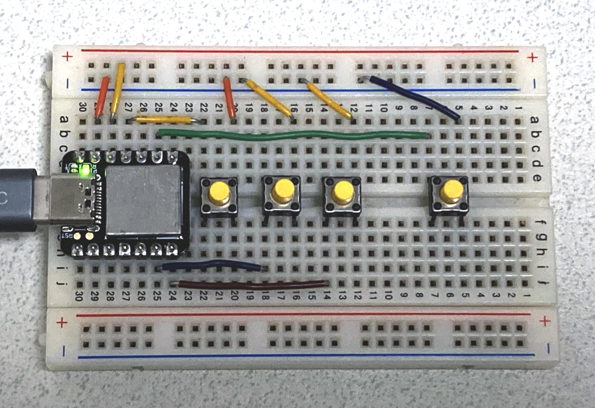

# xiao_circuitpython_macropad



This is a tiny prototype of USB macro pad using [seeduino XIAO](https://wiki.seeedstudio.com/Seeeduino-XIAO/) and [curcuitpython](https://circuitpython.org/).
It is made on a bread board.

`code.py` is based on [CircuitPython Keyboard Emulator](https://learn.adafruit.com/circuitpython-essentials/circuitpython-hid-keyboard-and-mouse#circuitpython-keyboard-emulator-2985260-1) from adafruit.

However it contains only the minimum required lib/py in order to use as HID keyboard because XIAO does not have enough flash.
Plus many lines are commented out in `lib/keycode.py` for the same reason.

It needs to download `.uf2` from [here](https://circuitpython.org/board/seeeduino_xiao/) before running.

# Memo

`code.py` has some modifications from the one in the [CircuitPython Keyboard Emulator](https://learn.adafruit.com/circuitpython-essentials/circuitpython-hid-keyboard-and-mouse#circuitpython-keyboard-emulator-2985260-1).

## Corresponding of pin outs and keymap 

Current Keymap is configured for amazon prime video :)

```
keypress_pins = [board.D10,          board.D5,           board.D6,               board.D8]

keys_pressed  = [Keycode.LEFT_ARROW, Keycode.SPACEBAR,   Keycode.RIGHT_ARROW,    Keycode.F]   # F is for full screen
```

Pin names such as `board.D10` can be found by typing into REPL of circuitpython running on XIAO like following:
```
>>> import board
>>> dir(board)
['__name__', 'A0', 'A1', 'A10', 'A2', 'A3', 'A4', 'A5', 'A6', 'A7', 'A8', 'A9', 'BLUE_LED', 'D0', 'D1', 'D10', 'D13', 'D2', 'D3', 'D4', 'D5', 'D6', 'D7', 'D8', 'D9', 'I2C', 'LED', 'MISO', 'MOSI', 'RX', 'SCK', 'SCL', 'SDA', 'SPI', 'TX', 'UART', 'board_id']
>>>
```

## LED polarity

Inverted for XIAO's onboard LED.

```
# Turn on the red LED
led.value = False

# Turn off the red LED
led.value = True
```

# tested environment

- circuitpython: [7.0.0](https://circuitpython.org/board/seeeduino_xiao/)
- library: [adafruit-circuitpython-bundle-py-20210930.zip](https://circuitpython.org/libraries)
